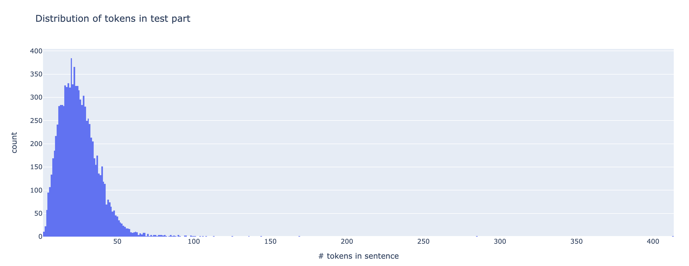

# Aeneas Error Detection system
=================
Prjctr course work
### Introduction

This work introduces [Aeneas](https://en.wikipedia.org/wiki/Aeneas "Aeneas wiki") Error Detection
 system - an accomplice of legendary GECToR.
 
The main goal of Aeneas - to detect substituted words in the sentences.

Aeneas consists of a Transformer-based encoder and linear layer for error token detection.


The system is entirely based on transformers from [huggingface](https://huggingface.co/transformers/index.html).
As encoder can be used any transformer model that supports [fast tokenizers](https://github.com/huggingface/tokenizers).

This work compares models with encoders `distilroberta`, `distilbert-cased`, `albert-base-v2`, and their ensemble based on majority votes.

The final metrics on hold out validation `data/val.src` presented in [Table 1](docs/Evaluation_metrics.md)


| Model                 |   Precision |   Recall |   F0.5     | prediction time   | # parameters   |
|:----------------------|:------------:|:---------:|:-------:    |:------------------:|:---------------:|
| [distilroberta-base](https://drive.google.com/drive/folders/1ViSy_vMDkfPWZZQ1qqfOQDI_FLf6oUzt?usp=sharing)    |       0.936 |    **0.868** | **0.9217** | 00:53s            | 82M            |
| [distilbert-base-cased](https://drive.google.com/drive/folders/1ViSy_vMDkfPWZZQ1qqfOQDI_FLf6oUzt?usp=sharing) |       0.922 |    0.825 | 0.9        | 00:55s            | 65M            |
| [albert-base-v2](https://drive.google.com/drive/folders/1ViSy_vMDkfPWZZQ1qqfOQDI_FLf6oUzt?usp=sharing)        |       0.87  |    0.81  | 0.85       | 01:59s            | 11M            |
| [ensemble](https://drive.google.com/drive/folders/1ViSy_vMDkfPWZZQ1qqfOQDI_FLf6oUzt?usp=sharing)              |       **0.94**  |    0.852 | 0.921       | -                 | -              |

**_NOTE:_** The models are under-fitted, and the final results can be improved by further training.

Model based on encoder `distilroberta-base` produced final `test.lbl`.

## Data

Models are trained on provided data for the substituted-words task.

The main statistics of data splits are presented in Table 2.

| Split   |   # sentences |   # tokens | Ratio of sentences with errors   | Ratio of tokens with errors   |
|:------------|----------:|-----------:|--------------------------:|---------------------------:|
| train       |   4438459 |  111898949 | 0.75                      | 0.09                       |
| val         |     10000 |     253869 | 0.76                      | 0.09                       |
| test        |     10000 |     250615 | -                         | -                          |

Transformer models have a limit for input tokens' maximal sequence length. 
System truncates long token sequences and extends predicted labels for such sentences with default "0" labels. 

The distribution of the amount words in the test sentences is shown in Fig.2


Train/dev split of `train` part is `98/2 `.

## Evaluation metric
Evaluation metric is `F.05` produced by `eval.py`

^2%20*%20Precision%20*%20Recall}{(0.5)^2*Precision%20%2B%20Recall})

where


# Model training and prediction

### Preparation
Before training the model:

Install the requirements
```python
pip install -r requirements.txt
```

Preprocess training data
```python
python3 utils/preprocess_data.py --source_file SOURCE_FILE \
                                 --labels_file LABELS_FILE \
                                 --output_file OUTPUT_FILE
```

Split training data into train/dev parts
```python
python3 utils/split_train_val.py --input_filename INPUT_FILENAME \ 
                                 --output_train_filename OUTPUT_TRAIN_FILENAME \
                                 --output_val_filename OUTPUT_VAL_FILENAME
```

### Training

Run script for model training
```python
python3 train.py --transformer_name TRANSFORMER_NAME \
                 --train_set TRAIN_SET \
                 --dev_set DEV_SET \
                 --model_dir MODEL_DIR
```

### Prediction

Run script to generate the prediction
```python
python3 predict.py --transformer_name TRANSFORMER_NAME \
                   --model_dir MODEL_DIR \
                   --source_file SOURCE_FILE \
                   --output_file OUTPUT_FILE \
```

### Ensemble

To combine labels of predicted files, run script
```python
python utils/ensemble.py --input_files INPUT_FILE [INPUT_FILE ...]
                         --output_file OUTPUT_FILE
```

### Reproducibility

The full list of commands to reproduce results listed in [Scripts.md](docs/Scripts.md)

## Future work

1. First of all - continue further training of models (they are under-fitted)
2. Try to label all word tokens, not only the first one. 
   The final word label can be the mean or selected by majority votes between token labels corresponding to one word.
3. Pre-train models on English GEC corpora - like W & I, FCE, NUCLE. 
   Instead of using correction labels, use a label that word has an error.
4. Search for the optimal threshold value to assign the "0" or "1" label.
5. Try other transformer-based encoders, ex `roberta-base`, etc.

